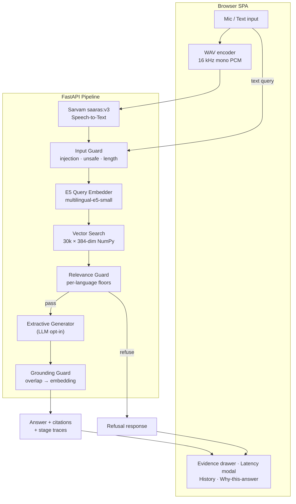

<div align="center">

# VOICE RAG

### Ask out loud. Get grounded answers — in English, Hindi, or Gujarati.

*A voice-first multilingual Retrieval-Augmented Generation system with hard refusal guardrails and a sub-50ms retrieval core.*

[](https://www.python.org/)
[](https://fastapi.tiangolo.com/)
[](tests/)
[](bench/results/summary.json)
[](LICENSE)

[Features](#-features) · [Architecture](#-architecture) · [Performance](#-performance) · [Quickstart](#-quickstart) · [API](#-api-reference) · [Guardrails](#-guardrails)

</div>

---

## Overview

**VOICE RAG** answers spoken or typed questions strictly from a curated multilingual corpus — and **refuses to answer when the corpus doesn't contain the answer**.

Ask *"Who is the Prime Minister of India?"* and most RAG demos will hallucinate an answer from whatever passage looks closest. VOICE RAG measures retrieval confidence against calibrated per-language floors and says:

> `Refused: Top retrieval score 0.779 below relevance floor 0.840`

Ask something the corpus *does* cover — in English, Hindi, or Gujarati — and you get a grounded, cited answer with a full latency breakdown and the exact evidence chain behind it.

| | |
|---|---|
| **Languages** | English, Hindi (हिन्दी), Gujarati (ગુજરાતી) |
| **Input modes** | Speech (hold-to-talk) and text |
| **Corpus** | 30,000 passages · MSMARCO-XI · 10k per language |
| **Embeddings** | `intfloat/multilingual-e5-small` · 384-dim |
| **STT** | Sarvam AI `saaras:v3` |
| **Answering** | Extractive (default, instant) · LLM via OpenRouter (opt-in) |

---

## Features

- **Voice-native UX** — hold <kbd>Space</kbd> (or the mic button) to speak; audio is captured, encoded to 16 kHz mono WAV in-browser, transcribed by Sarvam, and answered end-to-end.
- **Knows when not to answer** — relevance floors calibrated from measured score distributions refuse off-corpus questions instead of fabricating answers.
- **Language-aware retrieval** — script-based query detection (Latin / Devanagari / Gujarati) with soft same-language reranking, so an English question never surfaces a Gujarati tweet.
- **Grounded by construction** — every answer passes a grounding guard (token overlap → embedding similarity fallback); ungrounded output never reaches the user.
- **Full transparency** — evidence drawer with ranked passages + scores, stage-by-stage latency modal, and a *why-this-answer* chain showing every guard decision.
- **Blazing fast core** — P50 **40 ms**, P95 **50 ms**, 99.9% of queries under 200 ms across 1,500 benchmark queries.
- **Zero-build frontend** — vanilla JS SPA served directly by FastAPI. No node_modules, no bundler.
- **149 passing tests** — unit coverage for chunking, embedding, retrieval, guards, generation, orchestration, and schemas.

---

## Architecture



### Stage-by-stage cost (measured medians, n = 1500)

| Stage | P50 latency | What happens |
|---|---:|---|
| Input guard | 0.02 ms | Injection / unsafe content / length checks |
| Embed query | 16.96 ms | E5 `query:` prefix → 384-dim vector |
| Vector search | 23.14 ms | Cosine similarity over 30k passages + language rerank |
| Relevance guard | 0.01 ms | Top score vs calibrated floor |
| Answer generation | 0.07 ms | Best-sentence extraction from top passage |
| Grounding guard | 0.15 ms | Token overlap, embedding fallback if needed |
| **Total core** | **40.12 ms** | Target: < 200 ms |

---

## Performance

Benchmarked on 1,500 corpus queries (500 per language) against the prebuilt index.

| Metric | All | English | Hindi | Gujarati |
|---|---:|---:|---:|---:|
| P50 | 40.1 ms | 38.9 ms | 40.2 ms | 41.5 ms |
| P70 | 42.4 ms | 40.5 ms | 42.3 ms | 43.5 ms |
| P90 | 46.8 ms | — | — | — |
| P95 | 49.6 ms | — | — | — |
| Within 200 ms | 99.9% | 100% | 100% | 99.8% |

<sub>The single P100 outlier (21.7 s) is first-query model load; the model is now warmed at startup.</sub>

End-to-end voice round-trip: **~1.7 s** (≈1 s Sarvam STT + ≈40 ms pipeline).

---

## Quickstart

### Prerequisites

- Python 3.12+
- A [Sarvam AI](https://www.sarvam.ai/) API key (for speech-to-text)
- *(Optional)* An [OpenRouter](https://openrouter.ai/) API key to enable LLM-generated answers

### Setup

```bash
git clone https://github.com/The-Infernix/VOICE-RAG.git
cd VOICE-RAG

python -m venv .venv
.\.venv\Scripts\activate          # Windows
# source .venv/bin/activate       # Linux / macOS

pip install -r requirements.txt
```

### Configure

```bash
cp .env.example .env
```

```env
SARVAM_API_KEY=your_sarvam_key        # required for voice
OPENROUTER_API_KEY=your_openrouter_key  # optional, enables generative mode
```

### Run

```bash
uvicorn api.main:app --host 0.0.0.0 --port 7860
```

Open **http://localhost:7860** — the SPA is served at the root.

> The prebuilt index (`index/artifacts/`, 30k × 384-dim vectors) ships with the repo, so first run needs no indexing step. To rebuild from scratch: `python index/build_corpus.py` then `python index/build_index.py`.

---

## API Reference

### `POST /api/v1/query` — text question

```bash
curl -X POST http://localhost:7860/api/v1/query \
  -H "Content-Type: application/json" \
  -d '{"query": "How much does an Xbox 360 cost?", "top_k": 5}'
```

<details>
<summary><b>Example response</b></summary>

```json
{
  "status": "success",
  "query": "How much does an Xbox 360 cost?",
  "detected_language": "en",
  "answer": {
    "text": "On average, the Xbox 360 cost will be anywhere from $80 to as much as $250 depending on the model purchased.",
    "method": "extractive",
    "confidence": 0.933,
    "citations": [
      { "chunk_id": "doc_en_331047_0", "score": 0.933, "text": "..." }
    ]
  },
  "latency": {
    "embed_ms": 12.6,
    "retrieve_ms": 11.3,
    "answer_ms": 0.07,
    "total_core_ms": 24.0
  },
  "stages": [ ... ]
}
```

</details>

**Request fields**

| Field | Type | Default | Notes |
|---|---|---|---|
| `query` | string | — | Required, ≤ 500 chars |
| `lang` | string | auto | Force `en` / `hi` / `gu` (hard filter) |
| `top_k` | int | 10 | Passages retrieved |
| `allow_generative` | bool | `false` | Opt-in LLM answering |
| `use_cache` | bool | `true` | Semantic query cache |
| `debug` | bool | `false` | Include full retrieval context |

### `POST /api/v1/voice/query` — spoken question

```bash
curl -X POST http://localhost:7860/api/v1/voice/query \
  -F "audio=@question.wav" \
  -F "top_k=5"
```

Accepts WAV audio (16 kHz mono recommended). Returns the same envelope as `/api/v1/query`, plus the transcript in `query` and detected language.

### `GET /health`

```json
{ "status": "ok", "index_size": 30000, "providers": { "sarvam": true, "openrouter": true } }
```

Legacy aliases: `POST /ask`, `POST /ask-voice`.

---

## Guardrails

Three independent guards wrap the pipeline. Every decision is surfaced in the response's `stages` trace and the UI's *why-this-answer* chain.

### 1. Input Guard
Rejects empty/oversized queries, common prompt-injection patterns (*"ignore previous instructions"*), unsafe payloads (`<script>`, shell commands), and unsupported languages — before any compute is spent.

### 2. Relevance Guard — the refusal engine

Thresholds were **calibrated empirically**: top-1 cosine scores were measured for known-relevant queries (P25–P50 ≈ 0.84–0.86) and off-corpus junk (≈ 0.79–0.85), then floors were set at the separation point.

| Language | Floor | Low-confidence band |
|---|---:|---|
| English | 0.840 | +0.03 |
| Hindi | 0.850 | +0.03 |
| Gujarati | 0.840 | +0.03 |

```
Q: Who is the Prime Minister of India?   → REFUSED  (0.779 < 0.840)
Q: Who won the FIFA World Cup 2022?      → REFUSED  (0.796 < 0.840)
Q: How much does an Xbox 360 cost?       → answered ($80–$250, conf 0.933)
```

### 3. Grounding Guard
Answers must be traceable to retrieved text: token-overlap ≥ 0.231 passes instantly; otherwise an embedding-similarity check (≥ 0.794) runs. Ungrounded generations are replaced with the extractive answer or refused outright.

---

## Multilingual Pipeline

1. **Detection** — Unicode script analysis classifies the query (Gujarati block → `gu`, Devanagari → `hi`, else `en`). Voice queries inherit Sarvam's language code, normalized to base codes.
2. **Retrieval** — explicit `lang` acts as a hard filter; auto-detected language applies a soft +0.03 rerank bonus toward same-language passages over a 3× candidate pool.
3. **Enforcement** — the *query's* language (not the top chunk's) selects the relevance floor, so cross-language junk can't sneak through under a borrowed threshold.

```
Q: ભારતની રાજધાની શું છે?   → detected gu → Gujarati passages preferred
Q: भारत की राजधानी क्या है?  → detected hi → honest refusal (not in corpus)
```

---

## Frontend

A dependency-free vanilla JS single-page app (served by FastAPI itself):

- **Hold-to-talk** — press-and-hold <kbd>Space</kbd> or the mic button; release to send
- **Live states** — idle → listening → understanding → retrieving → answer / refused / no-evidence / error
- **Canvas visuals** — reactive orb + waveform driven by real analyser data
- **Evidence drawer** — every retrieved passage with rank, score, and metadata
- **Latency modal** — per-stage timing bars straight from the API's stage traces
- **Why-this-answer** — the guard decision chain for the current response
- **History** — recent Q&A persisted in `localStorage`
- **Technical mode** — toggle raw debug payloads for demos and grading

---

## Project Structure

```
VOICE-RAG/
├── api/
│   ├── main.py              # FastAPI app, endpoints, static mount
│   └── schemas.py           # Pydantic request/response models
├── pipeline/
│   └── orchestrator.py      # Stage sequencing, tracing, refusals
├── retrieval/
│   ├── embedder.py          # E5 wrapper (+ embedding cache)
│   ├── vector_store.py      # NumPy index + semantic cache
│   ├── search.py            # Retriever: search, rerank, caching
│   └── lang_detect.py       # Script-based language detection
├── guardrails/
│   ├── input_guard.py       # Injection / safety / validation
│   ├── relevance_guard.py   # Per-language refusal floors
│   └── grounding_guard.py   # Overlap + embedding grounding
├── generation/
│   ├── extractive.py        # Sentence extraction (default)
│   └── generative.py        # OpenRouter LLM (opt-in)
├── stt/
│   └── sarvam.py            # Sarvam saaras:v3 client
├── chunking/
│   └── base.py              # Chunking strategies
├── index/
│   ├── build_corpus.py      # MSMARCO-XI → corpus.jsonl
│   ├── build_index.py       # Embed + persist artifacts
│   └── artifacts/           # Prebuilt: chunks.json, vectors.npy
├── frontend/                # Zero-build SPA (HTML/CSS/JS)
├── bench/                   # Latency harness + results
├── tests/                   # 149 pytest cases
└── config.yaml              # Models, thresholds, tuning
```

---

## Testing

```bash
pytest tests/ -q
```

```
149 passed
```

Covers chunking, embedding math, vector-store sorting, cache isolation, all three guards (pass/refuse/edge cases), extractive + generative generation, orchestrator flows including refusal paths, schema validation, and language detection.

---

## Known Limitations

Honesty is a feature. Current boundaries:

- **Corpus-bounded knowledge** — the system only knows what MSMARCO-XI contains. Questions like *"What is the capital of India?"* have zero supporting passages and are correctly refused rather than answered from world knowledge.
- **Borderline similarity zone** — a small band (~0.84–0.86) overlaps between weak-relevant and strong-junk retrievals; per-language floors trade a little recall for a lot of precision.
- **Voice adds ~1 s** — Sarvam STT dominates end-to-end time; the RAG core itself stays under 50 ms.
- **Generative mode is opt-in** — external LLM calls take multiple seconds and are disabled by default to protect the latency budget.

---

## Tech Stack

| Layer | Technology |
|---|---|
| API | FastAPI, Uvicorn, Pydantic v2 |
| Embeddings | `intfloat/multilingual-e5-small` (384-dim) |
| Vector store | NumPy cosine index + semantic query cache |
| Speech | Sarvam AI `saaras:v3` |
| LLM (opt-in) | OpenRouter chat completions |
| Frontend | Vanilla JS, Canvas API, Web Audio/MediaRecorder |
| Testing | Pytest (149 cases) |

---

## License

Released under the [MIT License](LICENSE).

<div align="center">

**Built for HH Goa 2026 — Task 2**

*Because a RAG system that knows when NOT to answer is worth more than one that always does.*

</div>
